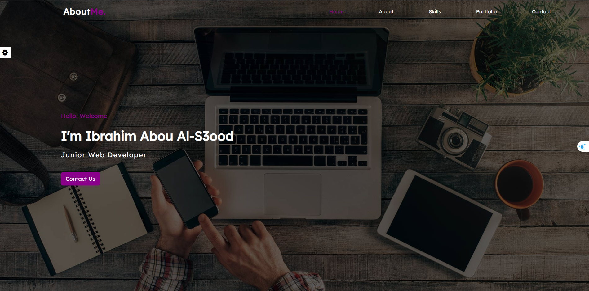
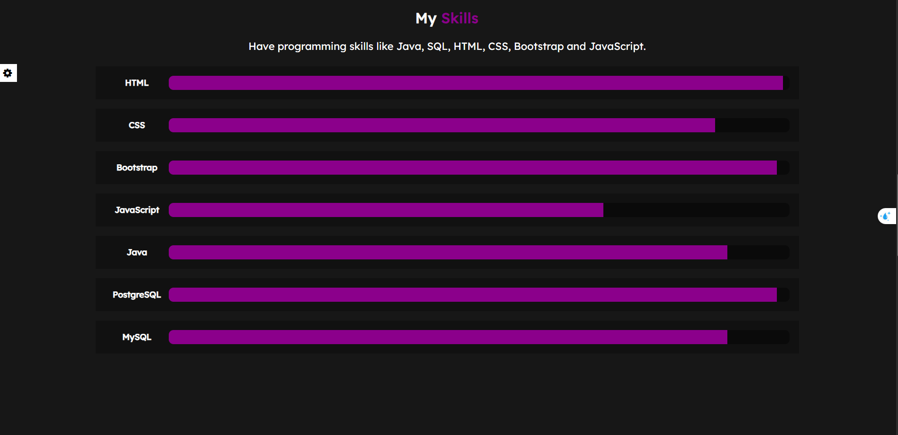
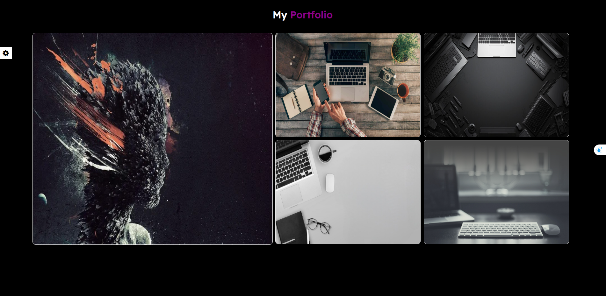
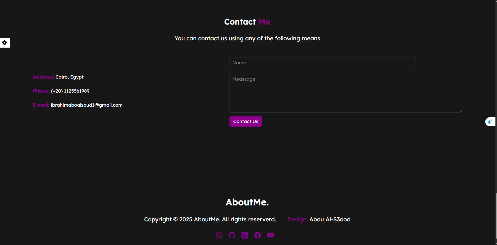

# 💼 About Me – Personal Portfolio Website

A fully responsive and interactive personal portfolio website created using **HTML**, **CSS**, and **JavaScript**. This site serves as a showcase of my skills, projects, and contact information.

## 🔗 Live Demo

Coming soon (or host it on GitHub Pages, Netlify, or Vercel and update here).

---

## 📸 Preview

---

## 🧰 Technologies Used

- HTML5
- CSS3
- JavaScript (Vanilla)
- Normalize.css
- Font Awesome
- Bootstrap Icons

---

## ✨ Features

- 🎨 Color Theme Customization (with LocalStorage)
- 🖼️ Dynamic Background Image Toggle
- ⚙️ Animated Settings Panel with Save State
- 📊 Scroll-Activated Skill Progress Bars
- 🖼️ Image Gallery with Popup Viewer
- 📱 Fully Responsive (Mobile & Desktop)
- 🔄 Reset Settings Button
- 🧠 Persistent User Preferences via LocalStorage

---

## 📁 Folder Structure

about-me-portfolio/
│
├── css/
│ ├── font-awesome.min.css
│ ├── normalize.css
│ └── master.css
│
├── js/
│ └── script.js
│
├── imgs/
│ ├── me.jpeg
│ ├── 01.jpg
│ ├── 02.jpg
│ └── ...
│
├── index.html
└── README.md

---

## 🧪 How It Works

- Click the **⚙️ settings icon** to toggle the sidebar.
- Choose a preferred **theme color** and **background mode**.
- Scroll down to the **Skills** section to see animated progress bars.
- Click any **portfolio image** to open a fullscreen popup.
- Press **Reset** to clear all saved preferences and reload the site.

---

## 📬 Contact

Feel free to reach out via:

- 📧 Email: ibrahimaboalsoud1@gmail.com  
- 📍 Location: Cairo, Egypt  
- ☎️ Phone: (+20) 1125561989  
- 🌐 [GitHub](https://github.com/Aboals3ood)  
- 💼 [LinkedIn](https://www.linkedin.com/in/ibrahim-aboals3ood-89264a224)  
- 📘 [Facebook](https://www.facebook.com/share/1RAR7Vjstx/?mibextid=qi2Omg)

---

## 📄 License

This project is licensed under the [MIT License](LICENSE). Feel free to use, modify, and share.

---

## 🙋‍♂️ Author

**Ibrahim Abou Al-S3ood**  
Junior Web Developer  
Java | JavaScript | HTML | CSS | Bootstrap | SQL

---
